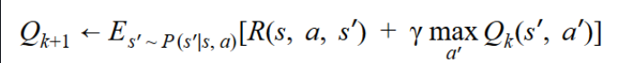
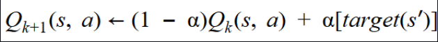
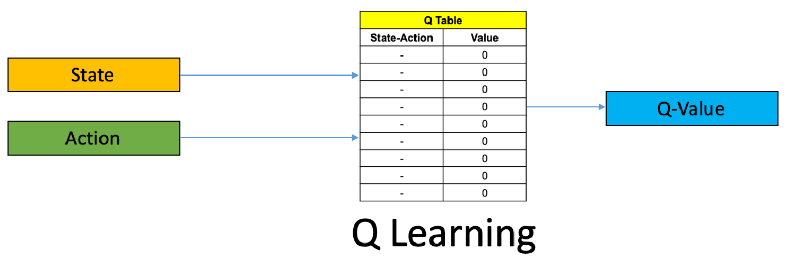
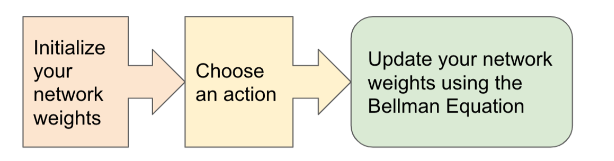
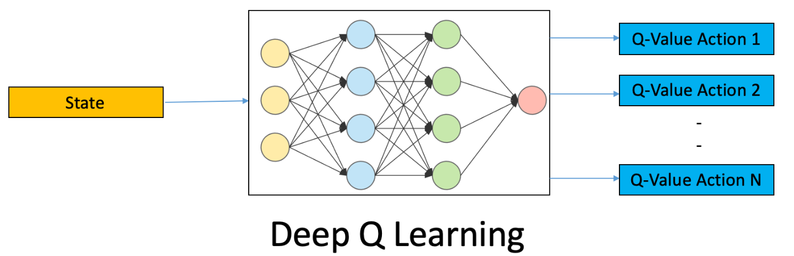

## Q-Learning

##### Q-learning is a model-free reinforcement learning algorithm to learn the value of an action in a particular state. It does not require a model of the environment (hence "model-free"), and it can handle problems with stochastic transitions and rewards without requiring adaptations.

 

#### In Q learning
 

##### We replace iterative format of bellman equation

 

##### And use it in form of expectation

##### Equation for training of the RL agent

##### Q-Learning using Q Table

 
 

## Deep Q-Learning
##### In Deep Q-learning, we use a neural network to approximate the Q-value function. The state is given as the input and the Q-value of all possible actions is generated as the output. 

 

##### Deep Q Algorithm

 

##### Bellman Equation

##### In deep Q-learning, we use a neural network to approximate the Q-value function. The state is given as the input and the Q-value of all possible actions is generated as the output. 
 

##### Deep Q-Learning using Neural Networks

## Some Results
 
 

##### Result of Q-learning on MountainCar-v0 Gym Environment
https://user-images.githubusercontent.com/46081121/189807697-2503f35f-d3ce-4e2d-8150-e072aa48fa48.mp4
 

##### Result of Q-learning on CartPole Gym Environment
https://user-images.githubusercontent.com/46081121/189808148-344d2078-e387-46d1-8c1e-7ec58263bb64.mp4
 

##### Result of Q-learning on Breakout Atari Gym Environment
https://user-images.githubusercontent.com/46081121/189808258-e3e0b0c7-9add-470c-b1aa-348a032cdc0b.mp4
